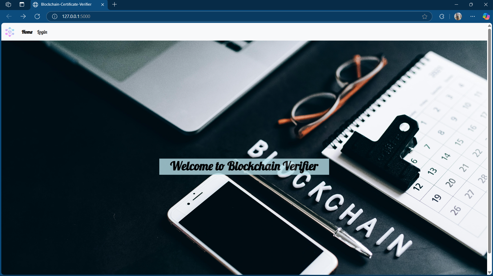
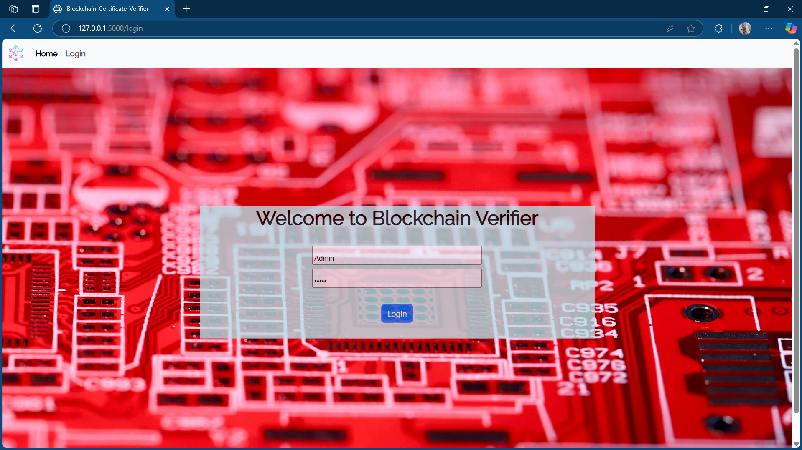
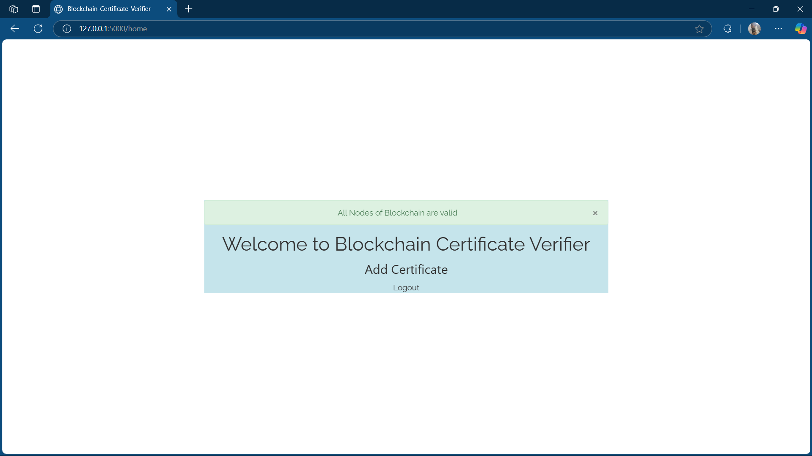
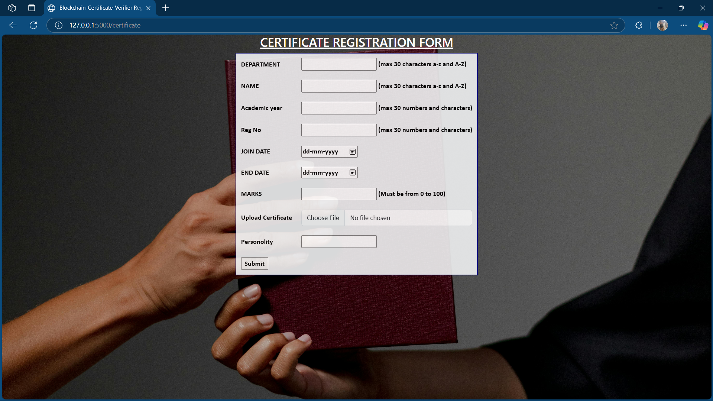
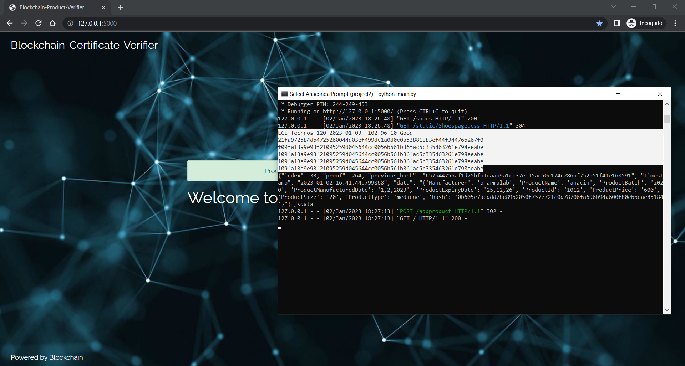
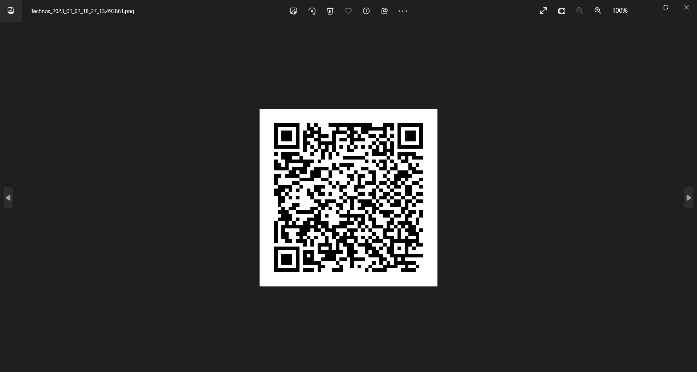
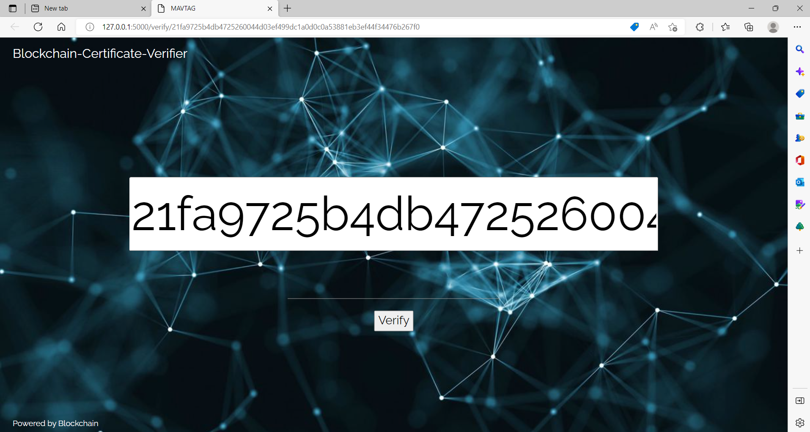
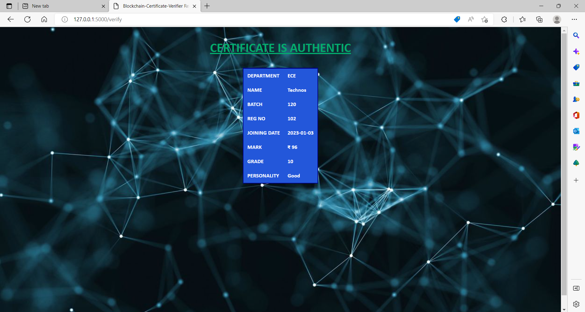

# Ethereum Smart Contract Certificate Verification

This repository contains a decentralized application designed to issue and verify certificates using Ethereum smart contracts. By leveraging blockchain technology, the system ensures the authenticity and integrity of certificates, making them tamper-proof and easily verifiable.

## Features

*   **Decentralized Certificate Issuance:** Institutions can issue certificates that are securely stored on the Ethereum blockchain.
*   **Tamper-Proof Verification:** Certificates are immutable and can be verified by anyone, ensuring their authenticity.
*   **User-Friendly Interface:** A web-based interface allows users to view and verify certificates seamlessly.
*   **Revocation (Optional):** Issuers can optionally revoke certificates, marking them as invalid.
* **Issuer Management:** The contract owner can add/remove issuing authorities.

## Here are some Screenshots

### 1. Main Dashboard



### 2. Issuer Login Page



### 3. Verification


### 4. Add Certificate



### 5. Registration  



### 6. CMD



### 7. QR Code Generation



### 8. QR Code Verifying


### 9. Digital Signature



### 10. Certificate Verification Results (Valid)



### 7. Certificate Verification Results (Invalid/Revoked)


## Prerequisites

Before setting up the project, ensure you have the following installed:

*   Node.js (v14.x or later recommended)
*   npm (v6.x or later recommended)
*   Python (v3.8 or higher)
*   MetaMask browser extension (or another Ethereum wallet)
*   Truffle Framework (for smart contract deployment):  `npm install -g truffle`
*   Ganache (for local blockchain development): [https://trufflesuite.com/ganache/](https://trufflesuite.com/ganache/)  (Or use a testnet like Goerli/Sepolia)

## Installation

1.  **Clone the Repository:**

    ```bash
    git clone [https://github.com/manohar6317/Ethereum-Smart-Contract-Certificate-Verification.git](https://github.com/manohar6317/Ethereum-Smart-Contract-Certificate-Verification.git)
    cd Ethereum-Smart-Contract-Certificate-Verification
    ```

2.  **Install Backend Dependencies (Python):**

    *   Create and activate a virtual environment (recommended):

        ```bash
        python3 -m venv env
        source env/bin/activate  # On Windows, use `env\Scripts\activate`
        ```

    *   Install required Python packages:

        ```bash
        pip install -r requirements.txt  #  Make sure you create this file! (See notes below)
        ```

3.  **Install Frontend Dependencies (Node.js):**

    ```bash
    cd static
    npm install
    cd ..  # Go back to the project root
    ```

4.  **Smart Contract Deployment (Truffle):**

    *   **Start Ganache:** Launch Ganache and create a new workspace.
    *   **Configure Truffle:**  Edit `truffle-config.js`. The provided configuration should work for Ganache's defaults.  For testnets (Goerli, Sepolia), see the "Testnet Configuration" section below.
    *   **Compile Contracts:**

        ```bash
        truffle compile
        ```

    *   **Deploy Contracts:**

        ```bash
        truffle migrate --network development  # Or your configured network (e.g., truffle migrate --network goerli)
        ```

        *Note: Record the deployed contract address.  You'll need it for the `.env` file.*

5. **Testnet Configuration (Optional - but Recommended):**

   If deploying to a testnet, you'll need to configure `truffle-config.js` and install additional packages:
     ```bash
       npm install dotenv @truffle/hdwallet-provider
     ```
     Then, add to `truffle-config.js`, *replacing placeholders* with your actual values:

     ```javascript
     // truffle-config.js
     require('dotenv').config(); // Load environment variables from .env
     const HDWalletProvider = require('@truffle/hdwallet-provider');
     const { MNEMONIC, INFURA_PROJECT_ID } = process.env;

     module.exports = {
       networks: {
         development: {
           host: "127.0.0.1",
           port: 7545, // Ganache default port
           network_id: "*"
         },
         goerli: { // Example: Goerli Testnet
           provider: () => new HDWalletProvider(MNEMONIC, `https://goerli.infura.io/v3/${INFURA_PROJECT_ID}`),
           network_id: 5,
           gas: 5500000,
           confirmations: 2,
           timeoutBlocks: 200,
           skipDryRun: true
         },
         // Add other networks (sepolia, mainnet) as needed
       },
       compilers: {
         solc: {
           version: "0.8.0" // Or the Solidity version in your contract
         }
       }
     };

     ```

6.  **Configure Environment Variables:**

    Create a `.env` file in the *root* directory of your project and add the following:

    ```
    WEB3_PROVIDER_URI=<Your_Ethereum_Node_URI>
    CONTRACT_ADDRESS=<Deployed_Contract_Address>
    MNEMONIC=<your seed phrase> # Only if deploying to a testnet/mainnet!  Keep this SECRET!
    INFURA_PROJECT_ID=<your Infura project ID> # Only if using Infura (testnet/mainnet)
    ```

    *   **`WEB3_PROVIDER_URI`:**  For Ganache, this will likely be `http://127.0.0.1:7545`.  For Infura (testnets/mainnet), it'll be something like `https://goerli.infura.io/v3/YOUR_PROJECT_ID`.
    *   **`CONTRACT_ADDRESS`:**  The address of your deployed `Certificate` contract (from the `truffle migrate` output).
    * **`MNEMONIC` and `INFURA_PROJECT_ID`:** Only required for testnets/mainnet.  *Never commit your mnemonic to version control!*

## Running the Application

1.  **Start the Backend Server (Python):**

    From the project root directory:

    ```bash
    python main.py  # Make sure your virtual environment is activated!
    ```

2.  **Start the Frontend Application (Node.js):**

    In a *separate* terminal, from the project root directory:

    ```bash
    cd static
    npm start
    ```

    This will usually open the application in your browser at `http://localhost:3000`.

## Usage

*   **Issuing Certificates:** Authorized institutions (added by the contract owner) can log in and issue new certificates.  They'll need to provide details like the recipient's Ethereum address, a certificate ID, and a hash of the certificate content (e.g., a hash of a PDF).
*   **Verifying Certificates:** Anyone can verify a certificate by entering the recipient's Ethereum address and the certificate ID.  The application will fetch the certificate data from the blockchain and display its details (including the hash, which can be compared to a local copy of the certificate).
* **Adding/Removing Issuers:** The contract owner (initially the deploying address) can add or remove authorized issuers through the contract's functions (using Truffle Console or a custom interface).
* **Revoking Certificates** An authorized issuer can revoke an issued certificate.

## Contributing

Contributions are welcome!  Please fork this repository and submit pull requests for any enhancements or bug fixes.  Follow good coding practices and include tests for your changes.

## License

This project is licensed under the MIT License. See the [LICENSE](LICENSE) file for details.

## Notes and Important Considerations

*   **This is a work in progress.**  The provided description mentions that some features may not be fully implemented.
*   **Security:** Pay close attention to security best practices, especially when dealing with private keys and sensitive data.  Never commit secrets to your repository.
*   **Error Handling:**  Implement robust error handling in both the frontend and backend.
*   **User Authentication:**  The provided description mentions "Authorized institutions can log in," but doesn't specify *how*. You'll need to implement a secure authentication mechanism. Consider using something like MetaMask integration for decentralized login.
*   **Frontend Framework:** You'll need to choose a frontend framework (React, Vue.js, Angular, etc.) and build the user interface within the `static` directory.
*   **Backend Logic:**  The `main.py` file will contain your backend logic (likely using Flask) to interact with the smart contract, handle user requests, and potentially manage authentication.
* **Testing**: Add comprehensive tests, for both smart contracts and frontend.

This improved README is significantly more detailed, provides clear instructions, and includes crucial information about project structure, dependencies, and security. Remember to fill in the missing pieces (like the actual frontend and backend code) and adapt it to your specific implementation.
